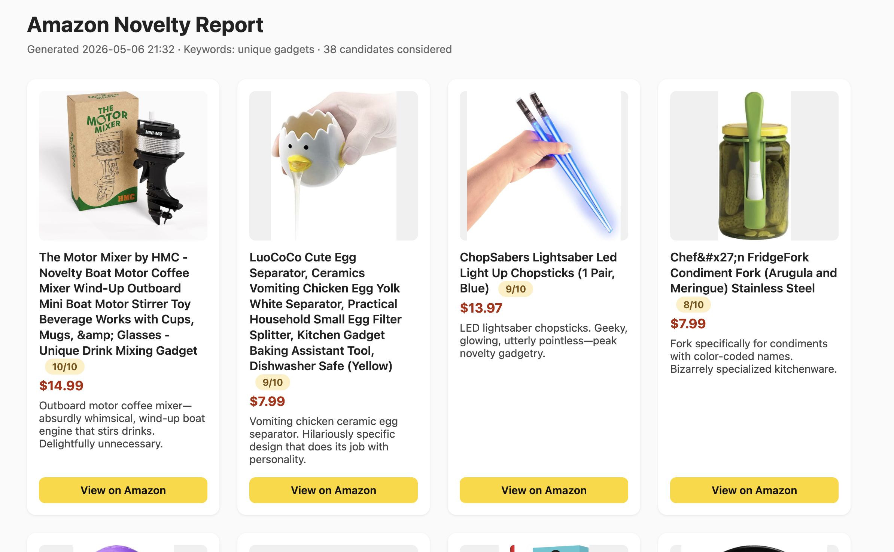

# amazon-report

**Find the weirdest, most delightful junk on Amazon — automatically.**

Searches Amazon for cheap stuff, asks Claude to pick the top 10 most *novel*
items, and drops a slick HTML report. Wind-up boat-motor coffee mixers. LED
lightsaber chopsticks. The kind of thing you didn't know existed and now
mildly need.



## Setup

```bash
python -m venv .venv && source .venv/bin/activate
pip install -e .
cp .env.example .env   # then fill in RAPIDAPI_KEY + ANTHROPIC_API_KEY
```

- `RAPIDAPI_KEY` — <https://rapidapi.com>, subscribe to *Real-Time Amazon Data* by letscrape.
- `ANTHROPIC_API_KEY` — <https://console.anthropic.com>.

## Use it — local web UI

```bash
amazon-report-web
# open http://127.0.0.1:8000
```

Form takes comma-separated keywords + min/max price. Hit Search; results
render inline.

## Use it — CLI

```bash
amazon-report "unique gadgets"
amazon-report --min-price 20 --max-price 100 "drone" "smart home gadgets"
```

Writes `reports/report-YYYY-MM-DD-HHMM.html`.

```
amazon-report [--min-price MIN] [--max-price MAX] keywords [keywords ...]
```

Defaults: min `0`, max `20`. Results are sorted by highest price first to
fight Amazon's bias toward cheap high-volume listings.

## Architecture

```
amazon_report/
├── fetch.py     # RapidAPI client → Product
├── rank.py      # Claude tool-use → ranked top-10
├── render.py    # Jinja2 → HTML report file
├── main.py      # CLI entry
└── web.py       # Flask local web UI
```

## License

MIT.
